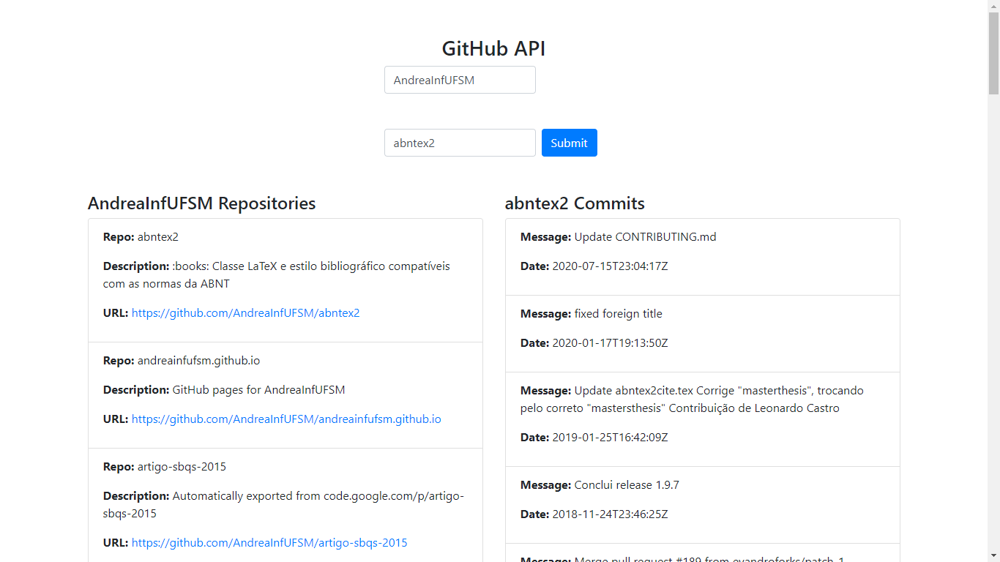

# Projeto2a: GitHub API e DOM Manipulation

.

#### Deploy

Preencha aqui a URL para acesso ao site publicado

#### Desenvolvedores

Matheus de Almeida

Ivan Maidana

#### Ambiente de desenvolvimento

- VS Code
- Extensão Live Server

#### Créditos

- https://docs.github.com/rest

#### Bastidores

Foi criada uma nova lista para conter os commits do repositório requisitado. O desenvolvimento foi feito a maior parte reutilizando o código do script original e adaptando as necessidades do projeto, as informações retiradas foram encontradas a partir do acesso da página da API e análise do conteúdo do JSON.

Para as adaptações do estilo da página, a página foi dividida ao meio, sendo destinada metade da página para os repositórios do usuário enquanto a outra metade foi destinada aos commits do repositório. Essa divisão foi realizada utilizando as classes "row" e "col-sm" do bootstrap. Foi também adicionado um código CSS que destaca o elemento da lista pelo qual o cursor está passando por cima no momento.

---
Projeto entregue para a disciplina de [Desenvolvimento de Software para a Web](http://github.com/andreainfufsm/elc1090-2024a) em 2024a
